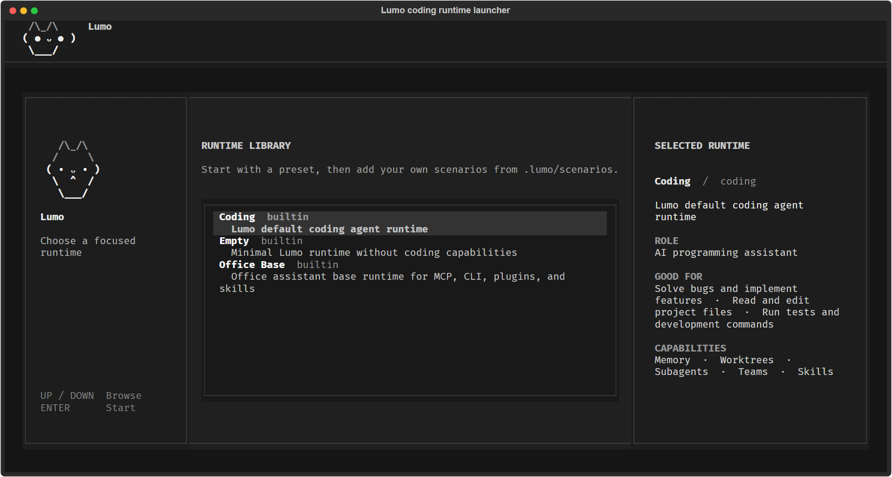
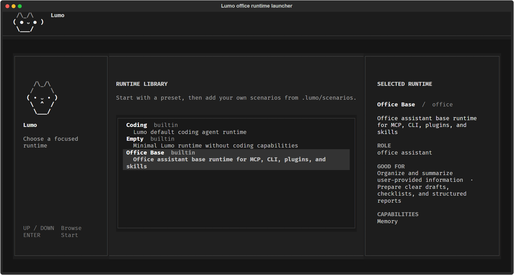
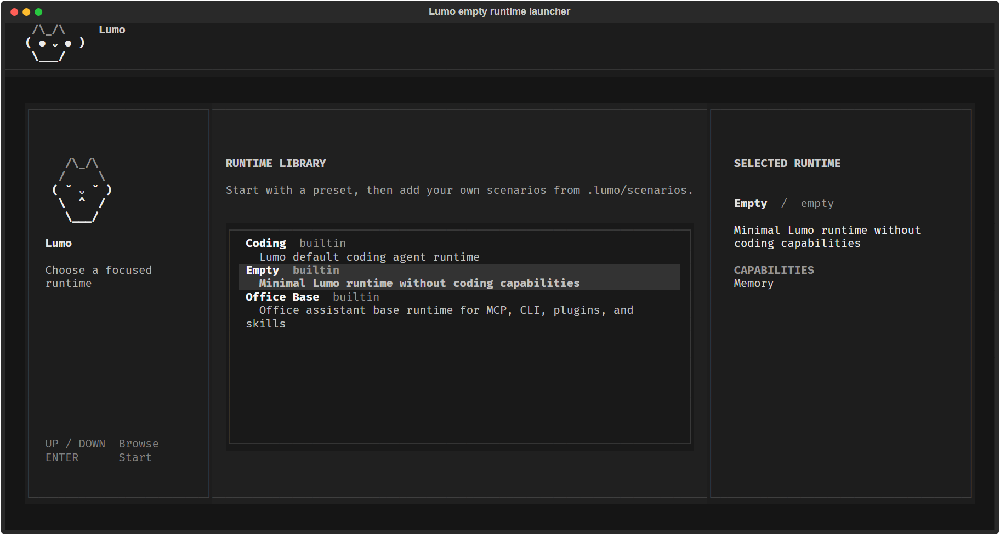

# Lumo Agent Harness

[English](README.md) | **简体中文**

一个面向终端的 Agent Harness，用于组合场景专属的 Agent Runtime，并在
同一个项目中安全地协调多个 Agent。



## 为什么选择 Lumo

### 可组合的场景 Runtime

场景不只是工具预设。Lumo 可以将内置能力包、MCP 服务、外部 CLI 工具、
Python 插件、Skill、Prompt、记忆、功能开关和安全策略组合成经过校验的
`RuntimeSpec`。

每个场景都有自己实际生效的工具集合、身份、Prompt、权限、记忆命名空间和
Session。TUI、Headless CLI 和 Remote 入口共用同一套 Resolver 与
RuntimeBuilder，确保声明的场景与真正执行的 Runtime 始终一致。



### 多 Agent 协作 Harness

Lumo 可以把大型任务拆分给 Coordinator 和多个 Worker Agent。每个 Worker
使用独立的 Git Worktree 隔离文件修改，Agent 之间则通过文件邮箱异步传递
结构化的任务分配、进度更新和关闭请求。

任务拆分、并行执行、进度跟踪和代码隔离都由 Harness 提供，而不是只依赖
Prompt 约束 Agent 自行协调。



## 开发

```powershell
uv sync
uv run lumo --help
uv run pytest
```

配置默认从 `.lumo/config.yaml` 加载。已有的 `.mewcode` 项目数据可以迁移，
且不会覆盖现有 `.lumo` 文件。
